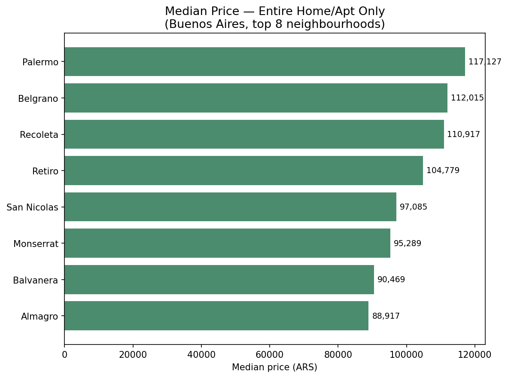

# Airbnb Buenos Aires — Price Analysis

An exploratory data analysis of 27,000+ Airbnb listings in Buenos Aires, identifying
what drives nightly price differences across the city.

## What this project does

Starting from raw listing data, this notebook:

1. **Cleans the data** — converts price from text (`"$185,388.00"`) to a numeric
   field, and removes a small fraction (~1%) of listings with clearly erroneous
   prices (data entry errors), identified via percentile analysis.
2. **Explores price distribution** across the dataset.
3. **Analyzes three key drivers of price:**
   - Neighbourhood (location)
   - Room type (entire home, private room, shared room)
   - Guest capacity (`accommodates`)
4. **Identifies and corrects a comparison bias** — an initial neighbourhood price
   comparison mixed different room types together, which distorted the result.
   Once corrected (comparing entire homes only, across neighbourhoods), the
   conclusion changes meaningfully.

## Key finding

Palermo — the neighbourhood with by far the most listings — initially looked only
moderately priced when comparing all room types mixed together. But once compared
like-for-like (entire homes/apartments only), Palermo is in fact the most expensive
of the top neighbourhoods — consistent with it being the most in-demand, touristic
area in the city.

This is a practical illustration of why controlling for confounding variables
matters before drawing conclusions from grouped comparisons.

## Tools

- Python
- pandas
- matplotlib

## Data source

[Inside Airbnb](http://insideairbnb.com/) — detailed listings data for Buenos Aires.

## About

Built by [Margionet](https://github.com/margiofabiolad) — physicist transitioning
into data analysis, with a background in statistical research from astrophysics.

